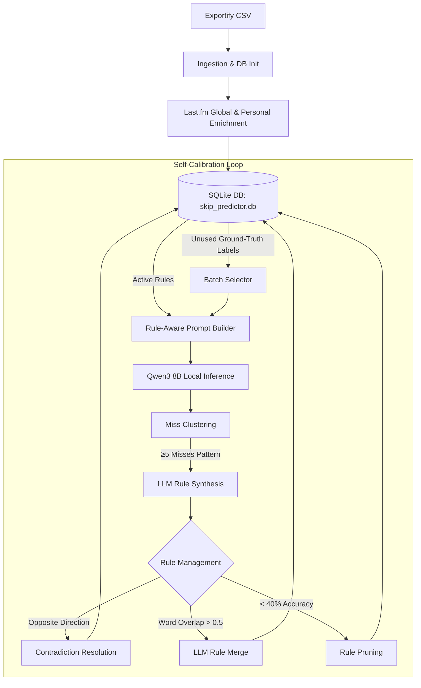

# Culler

A local, CPU-only agentic tool that predicts which tracks in old Spotify playlists you'd skip — and audits its own prediction errors to rewrite its own heuristic rules over time.

Built as a resume/portfolio project to explore agentic system design: prompt-driven local inference, self-calibration loops, and honest empirical debugging of a small local LLM. It is not intended for daily personal use or multi-user deployment.

---

## Why This Exists

Old Spotify playlists accumulate years of additions that no longer reflect current taste. Rather than manually re-listening to hundreds of tracks, Culler uses enrichment data (genre, popularity proxy, listening history) plus a locally-run LLM to flag likely skips for a fast first-pass cleanup — then systematically learns from where its own predictions were wrong.

---

## Architecture

### 1. Data Pipeline
Due to Spotify's API restrictions on personal apps, the ingestion pipeline runs on [Exportify](https://exportify.app/) CSV exports enriched via the Last.fm API:
- **Features Extracted**: Genre tags, popularity proxy, artist co-occurrence score, days-since-added, and personal lifetime scrobbles/playcounts.
- **Dataset**: 820 tracks ingested and verified clean in SQLite (`skip_predictor.db`).

### 2. Model Selection
Benchmarked four CPU-runnable models (Phi-4-mini, Qwen3 4B, Qwen3 8B, Mistral 7B Instruct v0.3 — all Q4_K_M quantized) on a fixed 50-track sample. 

**Qwen3 8B** was chosen based on **Skip-recall** (47.4% vs. 21.1% / 10.5%) rather than raw accuracy. A naive "always predict Keep" baseline scored highest on accuracy alone due to class imbalance, which would have been a misleading metric for model choice.

### 3. Self-Calibration Loop
The core engine of the project. In each round:
1. **Pulls fresh labeled tracks**: Fetches unused hand-labeled ground-truth tracks (`Keep` / `Skip`).
2. **Infers with injected rules**: Builds prompts injecting currently-active heuristic rules ranked by correctness rate.
3. **Clusters misses**: Groups prediction errors by feature pattern (single-feature, quartile-bucketed across the 820-track distribution; requires $\ge 5$ misses to qualify).
4. **Synthesizes rules**: Prompts Qwen3 8B (in thinking mode) to generate actionable curation rules from qualifying miss clusters.
5. **Evolves ruleset**:
   - **Contradiction Resolution**: Detects when a new candidate rule shares a trigger pattern with an existing rule but yields an opposite verdict direction (`favor_skip` vs. `favor_keep`). Resolves via newest-evidence-wins (retires older rule with `superseded_by`).
   - **Deduplication / Merge**: Merges overlapping same-direction rules via LLM if word similarity $> 0.5$.
   - **Pruning**: Deactivates rules with $\ge 10$ applications and $< 40\%$ accuracy.
   - **Cap Enforcement**: Maintains a strict cap of 12 active rules.
6. **Provenance Tracking**: SQLite schema tracks full rule lifecycle (`times_applied`, `times_correct`, `created_by_run_id`, `superseded_by`, `retirement_reason`, `verdict_direction`, `trigger_feature`, `trigger_bucket`), alongside a JSON log in `runs`.

### 4. Hardware Environment
- **Machine**: Dell Latitude 5500 (Intel Core i7-8665U, 8 vCPUs, ~15 GB RAM, Intel UHD 620).
- **Execution**: 100% CPU-only local inference via `llama-cpp-python`, accessed over SSH from a MacBook. Zero external GPU or cloud inference APIs.

---

## Key Finding: The `/no_think` Grounding Bug

Early iterations ran Qwen3 8B in low-latency `/no_think` mode (~20–25s/track). At first glance, predictions seemed reasonable. However, a detailed per-track audit against ground truth uncovered that the model was hallucinating its reasoning:
- **Flat Confidence**: Confidence scores were stuck at a constant ~85 regardless of feature extremity.
- **Factual Hallucinations**: Reasoning text directly contradicted the input data (e.g. claiming a track with 49 personal scrobbles had "zero playcount").

### The Fix & The Trade-off
- **The Fix**: Removing `/no_think` and allowing the full `<think>` reasoning trace restored grounded, feature-accurate reasoning and meaningful confidence variance. `max_tokens` was increased to 8,192 to prevent mid-thought truncation.
- **The Cost**: Thinking mode takes ~230–270s/track on this CPU (~10x slower). A full 820-track run would require ~41 hours on CPU, so calibration was structured around iterative 15–20 track batches.

> **Takeaway**: A small local LLM can appear coherent while silently ungrounded. Enforcing reasoning integrity has a measurable compute cost that must be accounted for in system design.

---

## Experiment: Prompt-Engineering Reasoning Length (Negative Result)

Thinking-mode traces showed heavy circular reasoning — the model frequently re-derived its conclusions using hedging language (*"wait"*, *"alternatively"*, *"hmm"*). Two prompt variants were evaluated on a fixed 3-track sample, measuring hedge-word frequency as a proxy for rumination:

| Variant | Hedge-Word Count | Runtime (3 tracks) |
| :--- | :---: | :---: |
| **Baseline prompt** | 13 | 13m 24s |
| **+ 3-step structure, feature priorities, explicit anti-hedging rule** | **28** | 13m 23s |

**Finding**: Explicitly instructing the model *not* to use hedging language roughly **doubled** hedge-word occurrences (13 $\rightarrow$ 28) with no change in latency. The negative instruction caused token fixation. 

The anti-hedging line was reverted, while the structured 3-step reasoning format (1: Strongest Keep signal, 2: Strongest Skip signal, 3: Winner & why) and feature-priority weighting were retained.

---

## Known Limitations

- **Oscillation over Convergence**: The calibration mechanism executes cleanly end-to-end (clustering $\rightarrow$ synthesis $\rightarrow$ contradiction resolution), but initial rounds exhibit rule oscillation across small batches rather than monotonic accuracy gains.
- **Parse-Failure Rate**: Occasional JSON format drift or truncation causes a ~15–30% parse-failure rate on certain runs, handled gracefully by dropping the track from the consolidation batch while marking the label as processed.
- **Lifetime vs. Recency Playcounts**: `user_playcount` represents lifetime scrobbles, which cannot distinguish between a dormant past favorite and an active daily track.
- **Full Dataset Run**: Full 820-track passes were deferred due to the ~41-hour CPU runtime requirement in thinking mode.

---

## Key Engineering Takeaways

1. **100% Local Autonomous Reasoning**: All prediction, clustering, synthesis, merge, and contradiction checks run locally through Qwen3 8B. No cloud LLMs participate in the evaluation or calibration pipeline.
2. **Schema & Environment Divergence**: In remote development setups (SSH to headless laptop), assistant-generated schema migrations must be verified directly against the live database rather than local mock environments. All Phase 3 migrations in Culler were made strictly idempotent via `PRAGMA table_info` checks at startup.

---

## Tech Stack

- **Model**: Qwen3 8B Instruct (Q4_K_M GGUF via `llama-cpp-python`)
- **Storage**: SQLite (`skip_predictor.db`)
- **Data Ingestion**: Exportify CSV + Last.fm REST API
- **Language**: Python 3.10+
