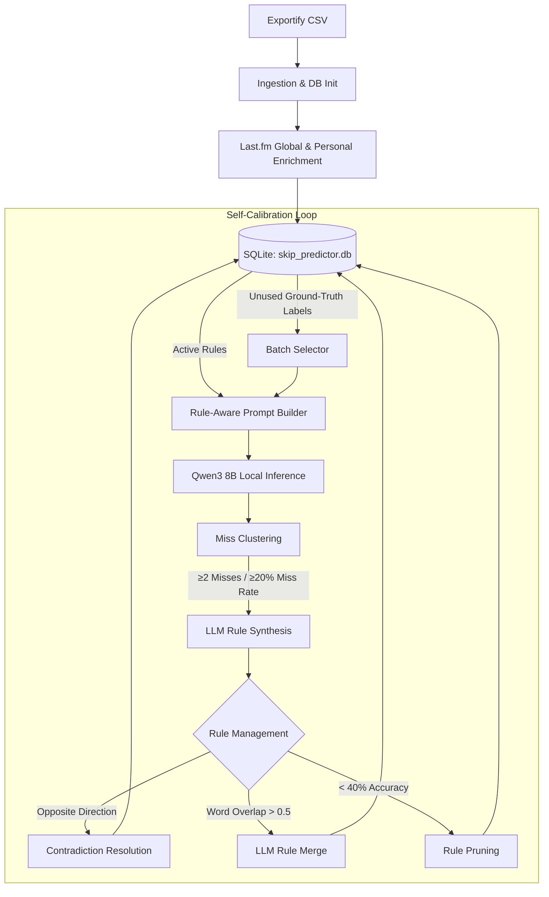

# Culler

A local, CPU-only experiment that flags tracks to skip in bloated Spotify playlists, then uses prediction errors to auto-tune its own heuristic rules.

Built on an old Dell Latitude 5500 (Intel i7-8665U, 4c/8t, CPU-only) to benchmark local 8B reasoning, test self-correction loops, and inspect failure modes — without cloud APIs. Not intended for daily use or multi-user deployment.

---

## Why

Old playlists accumulate years of additions you'd never actually play. Rather than re-listening to 820 tracks manually, I wanted to see if a local LLM could make a reasonable first pass — and whether a feedback loop would actually improve its predictions over time.

---

## How It Works

### 1. Data Pipeline
Spotify's API no longer supports the endpoints this kind of project needs without Developer Mode and Premium. So the ingestion pipeline uses [Exportify](https://exportify.app/) CSV exports and enriches them via the Last.fm API:

- **Features**: genre tags, popularity proxy (Last.fm global listeners), artist co-occurrence score (how often the artist appears across the playlist relative to all tracks), days-since-added, and personal lifetime scrobble count.
- **Dataset**: 820 tracks, deduplicated and verified clean.

### 2. Model Selection

Benchmarked four quantized models (Phi-4-mini 3.8B, Qwen3 4B, Qwen3 8B, Mistral 7B Instruct v0.3 — all Q4_K_M) on a fixed 50-track labeled sample.

The core trade-off: **speed vs. reasoning quality**.

- Smaller models (Phi-4-mini, Qwen3 4B) ran fast (~5–15s/track) but collapsed into naive majority-class predictions — essentially "always Keep" — regardless of feature values.
- Qwen3 8B produced real feature-grounded reasoning, but only in thinking mode, which costs ~230–270s/track on this CPU.

The deciding metric was **Skip-recall**, not accuracy. A baseline of "always predict Keep" scores highest on accuracy due to class imbalance, which would have been a useless model. Qwen3 8B hit 47.4% Skip-recall vs. 21.1% / 10.5% for the smaller alternatives. Speed was traded away in favor of reasoning that actually varies by input.

### 3. Calibration Loop

Each round:
1. Pull a batch of unused hand-labeled tracks (`keep` / `skip` from ground truth).
2. Build a prompt per track, injecting currently-active heuristic rules ranked by correctness rate.
3. Run Qwen3 8B and collect JSON verdicts.
4. **Cluster misses** by shared feature patterns (single-feature, quartile-bucketed across the 820-track distribution). Threshold: $\ge 2$ misses in a bucket, or $\ge 20\%$ miss rate on the batch.
5. For qualifying clusters, call the LLM in thinking mode to synthesize a candidate heuristic rule.
6. **Update the ruleset**:
   - If the new rule's trigger pattern conflicts with an existing rule's verdict direction → retire the older rule (newest-evidence-wins).
   - If word overlap with an existing same-direction rule exceeds 0.5 → merge via LLM.
   - Rules with $\ge 10$ applications and $< 40\%$ correct rate get pruned.
   - Hard cap of 12 active rules total.
7. Write everything to SQLite: `rules`, `runs`, updated `labels.used_in_run_id`.

**Rule schema** tracks: `times_applied`, `times_correct`, `created_by_run_id`, `superseded_by`, `retirement_reason`, `verdict_direction`, `trigger_feature`, `trigger_bucket`.

### 4. Hardware

- **Machine**: Dell Latitude 5500 — Intel Core i7-8665U (4 physical cores, 8 threads), ~15 GB RAM, Intel UHD 620.
- **Inference**: `llama-cpp-python`, CPU-only. Pinned to 4 physical cores (`N_THREADS = 4`) to avoid AVX2 thread contention from hyperthreading.
- **Access**: SSH from a MacBook. No GPU. No cloud APIs anywhere in the inference pipeline.

---

## The `/no_think` Bug

Early runs used Qwen3 8B's low-latency `/no_think` mode (~20–25s/track). The output looked plausible. Then I checked it against ground truth on individual tracks.

The model was quietly hallucinating:
- **Confidence was flat at ~85** regardless of how extreme the features were.
- **Reasoning directly contradicted the input** — e.g. describing a track with 49 personal scrobbles as having "zero playcount", or flagging a high co-occurrence artist as unknown.

**Fix**: Removing `/no_think` lets the full `<think>...</think>` reasoning trace run before the JSON output. After the fix, confidence varied meaningfully and reasoning was grounded to the actual feature values. `max_tokens` was raised to 4096 and context window to 8192 to prevent mid-trace truncation.

**Cost**: ~230–270s/track. A full 820-track pass would take ~41 hours. So calibration runs in batches of 15–20 tracks, not the full corpus.

> **The lesson here:** a compact LLM can produce output that reads as coherent while being factually detached from the input. You have to check it against ground truth per-sample, not just read a few outputs and assume it's working.

---

## Experiment: Telling the Model Not to Hedge (Negative Result)

Thinking-mode traces showed the model re-deriving the same conclusion multiple times using *"wait"*, *"alternatively"*, *"hmm"* before settling. I tried two variants on a fixed 3-track sample, counting hedge-word occurrences as a proxy for circular reasoning:

| Variant | Hedge-Word Count | Runtime (3 tracks) |
| :--- | :---: | :---: |
| **Baseline prompt** | 13 | 13m 24s |
| **+ 3-step structure, signal priorities, explicit "do not hedge" rule** | **28** | 13m 23s |

Explicitly telling the model not to use hedging language roughly **doubled** occurrences. The instruction apparently causes the model to fixate on the forbidden tokens rather than avoid them.

The anti-hedging line was removed. The structured 3-step format (1: strongest Keep signal, 2: strongest Skip signal, 3: which wins and why) was kept, since it hadn't been isolated as the source of the regression.

---

## Current State & Known Issues

- **Convergence not demonstrated yet**: The loop executes cleanly end-to-end — miss clustering, rule synthesis, contradiction detection all work — but across the rounds run so far, rules oscillate rather than monotonically improving accuracy. Small batch sizes make it hard to separate signal from noise.
- **Early parse-failure rate**: First runs saw ~15–30% parse drops due to unhandled markdown fencing and truncated `<think>` traces. Fixed by switching to greedy regex JSON extraction and raising `DEFAULT_MAX_TOKENS` to 4096.
- **Playcount is lifetime, not recency**: `user_playcount` is a total scrobble count. It can't tell "still in rotation" from "loved three years ago, never touched since." A recency signal from `user.getRecentTracks` was considered but not built — scrobbling was likely dormant or unreliable over the period these tracks were added, so a derived recency feature would probably be as noisy as the lifetime count.
- **Full library run deferred**: The ~41-hour CPU estimate for a full 820-track pass makes it impractical on this hardware. Evidence is deliberately built on smaller rounds.

---

## Lessons

1. **All reasoning in the pipeline is local**: prediction, miss clustering, rule synthesis, contradiction resolution, and rule merging all run through Qwen3 8B on-device. The coding assistant (Gemini, via IDE) was used only for writing and debugging code — it never touched the playlist data or made any predictions.
2. **Remote DB state and local assistant state diverge silently**: Hit this more than once. A coding assistant reported schema changes as "verified" against its own in-memory environment, not the real database on the remote machine. All migrations in this project use `PRAGMA table_info` checks and are designed to be idempotent.

---

## Stack

- **Model**: Qwen3 8B Instruct Q4_K_M (GGUF, via `llama-cpp-python`)
- **DB**: SQLite (`skip_predictor.db`, gitignored)
- **Data**: Exportify CSV + Last.fm API (disk-cached)
- **Language**: Python 3.10+
